# Telemetry Golang Project

ARM64 LinuxOS（NVIDIA L4T）上で動作する高信頼性双方向テレメトリアプリケーション。  
EDGEPLANT T1に最適化されており、SocketCANおよび内蔵GNSSモジュールからデータを取得・集約して外部へ伝送する「上りフロー」と、外部からの制御コマンドを実機CANへ安全に介入させる「下りフロー」を完全並行で制御します。


-FCC624?style=for-the-badge&logo=linux&logoColor=black)


## 🚀 Future Roadmap & Portability Strategy

本プロジェクトは、Phase 01においてEDGEPLANT T1（ARM64）をターゲットとしてデプロイしますが、  
最終ゴールとして**「OS環境（Linux）に依存し、ハードウェアアーキテクチャ（x86_64 / 汎用ARM64）には依存しないアプリケーション」**を目指します。  
このポータビリティを担保するため、以下の設計方針を徹底します。

### 1. デバイスパスの完全外部設定化
- 内蔵GNSS（u-blox NEO-M8U）へのアクセスパスは、T1固有の `/dev/ttyTHS1` をコード内にハードコーディングせず、必ず `config/config.yaml` または環境変数から動的に注入します。
- 汎用Linux環境（`/dev/ttyUSB0` など）やシミュレータ環境への移行時も、コードの修正なしで設定変更のみで追従可能とします。

### 2. メッセージブローカーの抽象化 (DIの徹底)
- 送信先ミドルウェア（MQTT / RabbitMQ）のロジックは、Goのインターフェースを用いて抽象化します。
- 接続先プロトコルの切り替えや、将来的な別のブローカー（Kafka、HTTP/REST等）への拡張時も、コアロジック（CAN/GPS受信側）に影響を与えない疎結合な設計を維持します。

### 3. マルチアーキテクチャ対応コンテナの構築
- Dockerfileはクロスビルドを想定したマルチステージビルド構成とし、x86_64環境でのローカル開発・シミュレーション実行と、ARM64実機環境へのデプロイを同一のソースベースで切り替え可能にします。

## 📋 System Requirements & Dependencies

### ハードウェア環境
- **本体**: EDGEPLANT T1 (型式: ET1-128NJA)
  - SoM: NVIDIA Jetson TX2 4GB
  - ストレージ: 16GB eMMC + 128GB 産業グレード SSD
- **CANインターフェース**: EDGEPLANT CAN-USB Interface (型式: EP1-CH02A)
  - USB経由で接続することで、ホストOS側で `can0`, `can1` として認識されます。
- **GNSSモジュール**: u-blox NEO-M8U（本体内蔵）
  - 内部シリアルポート（`/dev/ttyTHS1`）経由でアクセスします。

### ソフトウェア環境
- **OS**: NVIDIA L4T (Linux for Tegra / Ubuntuベース)
- **ミドルウェア**:
  - `gpsd` (内蔵GNSSのNMEA/UBXストリームの管理用)
  - `can-utils` (CAN通信の動作確認・デバッグ用)
- **開発言語**: Go 1.25以上 (ARM64環境へのクロスコンパイルに対応していること)

---

## 🎯 Requirements Specification

- **機能要件**:
  - **REQ-01**: SocketCAN（`can0`/`can1`）からデータをノンブロッキング/並行で読み込み、JSON構造体に変換する。
  - **REQ-02**: 受信したCANメッセージはDBC定義に基づき、10進数の物理値へ変換する。
  - **REQ-03**: 内蔵GPSレシーバー（NEO-M8U）からGPSD経由で位置・時刻情報（最高20Hz更新）を取得しパースする。
  - **REQ-04**: ネットワーク状態を常時監視し、MQTTまたはRabbitMQへデータを自動再接続機能付きでPublishする。
  - **REQ-05**: MQ (MQTT or RabbitMQ) の特定トピック/キューをSubscribeし、外部からの制御コマンド（JSON形式）をノンブロッキング/非同期で受信する。
  - **REQ-06**: 受信したJSON信号をDBC定義（エンコード規則）に基づいてCANメッセージへ変換し、指定されたSocketCAN（`can0`/`can1`）へ即座にイベント送信する。
- **非機能要件**:
  - メモリリークのない堅牢な長期稼働（車載R&D・過酷な振動・高低温環境下での安定動作を想定）。
  - 車載時のIG（イグニッション）連動信号に追従し、安全に自動シャットダウン・起動を行うプロセス管理。

---

## 📐 Basic Design

### Data Flow & Topic Naming Convention

MQTT/RabbitMQにおけるメッセージトピックは、以下の規約に準拠して動的に生成・バインドされます。
* **命名規則**: `/${direction}/${DEVICE_ID}/${prefix}`
  * `${direction}` : 上り送信は `tx`、下り受信は `rx` と定義。
  * `${DEVICE_ID}` : コマンドライン引数から注入される一意の端末識別子。
  * `${prefix}` : 設定ファイルの `telemetry_options` から読み込まれるトピック接頭辞。

```mermaid
graph LR
    %% クラス・コンポーネントのスタイル定義
    classDef external stroke:#333,stroke-width:2px;
    classDef goroutine stroke:#0c5460,stroke-width:1px;
    classDef channel stroke:#856404,stroke-width:1px,shape:circle;
    classDef broker stroke:#155724,stroke-width:2px;

    %% ==========================================
    %% 外部デバイス・ミドルウェア層
    %% ==========================================
    subgraph External_Devices [外部デバイス / ホストOS]
        CAN_HW[EDGEPLANT CAN-USB <br> SocketCAN: can0 / can1]:::external
        GPS_HW[内蔵GNSSモジュール <br> u-blox NEO-M8U]:::external
        GPSD[gpsd デーモン <br> localhost:2947]:::external
    end

    %% ==========================================
    %% 外部デバイス・管理層
    %% ==========================================
    subgraph External_Controler [外部PCアプリケーション]
        CTRL_PC[コマンド送信機]:::external
        VIEW_PC[状態受信機]:::external
    end

    %% ==========================================
    %% メッセージブローカー層
    %% ==========================================
    subgraph MQ_Broker [メッセージブローカー]
        Broker[MQTT / RabbitMQ <br> Cloud or Server]:::broker
    end

    %% ==========================================
    %% Goアプリケーション内部アーキテクチャ層
    %% ==========================================
    subgraph Go_App [edgeplant-telemetry-go]
        %% チャネル定義
        dataChan((dataChan)):::channel
        cmdChan((cmdChan)):::channel

        %% Goroutine（タスク）定義
        Task1[Task 1: CAN Recv <br> can.StartReceiver]:::goroutine
        Task2[Task 2: GPS Recv <br> gps.StartReceiver]:::goroutine
        Task3[Task 3: Publisher <br> publisher.StartWorker]:::goroutine
        Task4[Task 4: Subscriber <br> subscriber.StartWorker]:::goroutine
        Task5[Task 5: CAN Tx <br> can.StartTransmitter]:::goroutine
    end

    %% ==========================================
    %% 上り（Telemetry）データフロー
    %% ==========================================
    CAN_HW -->|RAW CANフレーム| Task1
    GPS_HW -->|Serial: /dev/ttyTHS1| GPSD
    GPSD -->|NMEA/UBXデータ| Task2

    Task1 -->|物理値変換| dataChan
    Task2 -->|位置情報構造体| dataChan
    dataChan -->|非同期集約| Task3
    
    Task3 -->|"Publish to: /tx/{DEVICE_ID}/state <br> {'TimeStamp': '...', 'vehicle': {...}, 'location': {...}}"| Broker
    Broker --> |"Subscribe from: /tx/{DEVICE_ID}/state <br> {'TimeStamp': '...', 'vehicle': {...}, 'location': {...}}"| VIEW_PC

    %% ==========================================
    %% 下り（Command / Event）データフロー
    %% ==========================================
    CTRL_PC -->|"Publish to: /rx/{DEVICE_ID}/ctrl <br> {'bus_id': 'can0', 'frame_id': '0x123', 'signals': {...}}" | Broker
    Broker -->|"Subscribe from: /rx/{DEVICE_ID}/ctrl <br> {'bus_id': 'can0', 'frame_id': '0x123', 'signals': {...}}" | Task4
    
    Task4 -->|JSONパース / 内部コマンド構造体化| cmdChan
    cmdChan -->|コマンド取り出し| Task5
    Task5 -->|DBCエンコード / バイナリ化| CAN_HW

```



#### コマンド送信器（CTRL_PC）から送られてくるJSONサンプル

下りコマンドの `frame_id` は16進数表現（`"0x123"`）を受け付けます。シグナルデータは、シグナル名をキーとしたオブジェクトマップ形式で判定し、`bool` または `float64` の動的型を自動パースします。

```json
{
  "Timestamp": "2024-06-10T15:30:30+09:00",
  "bus_id": "can0",
  "frame_id": "0x123",
  "signals": {
    "ControlCommand": true,
    "ControlValue": -10.0
  }
}

```

#### 状態受信機（VIEW_PC）が受け取るJSONサンプル

上りテレメトリは設定された送信周期（例: 100ms）ごとに、ホワイトリスト指定されたCAN-ID（`latch_frame_ids`）の最新ラッチデータとGPSデータを一元集約した Snapshot 状態として配信されます。

```json
{
  "Timestamp": "2024-06-10T15:30:30+09:00",
  "vehicle": {
    "can0": {
      "speed": 10.0,
      "left_turn": true,
      "right_turn": false,
      "steering_deg": 245.0,
      "brake": 45.0
    }
  },
  "location": {
    "latitude": 35.6812,
    "longitude": 139.7671,
    "altitude": 24.5,
    "speed": 10.0,
    "timestamp": "2024-06-10T15:30:30+09:00"
  }
}

```

### ディレクトリ構成

```text
edgeplant-telemetry-go/
├── .github/
│   └── workflows/ci.yml   # ニア実機(ARM64)クロスビルドCI
├── config/
│   ├── can.dbc                # DBCファイル
│   └── config.yaml            # 接続先MQTT/RabbitMQ、CANビットレート、トピック・ラッチ設定
├── src/
│   ├── internal/
│   │   ├── logger/                # zap logger + lumberjack
│   │   ├── dispatcher/            # channel間データハンドリング
│   │   ├── cfg/                   # config ラッパー（yaml.v3によるパサー）
│   │   ├── canhandler/            # SocketCANハンドラー・DBCパサー（数値ID高速ラッチ搭載）
│   │   ├── gps/                   # GPSDクライアントラッパー
│   │   └── mq/                    # MQTT/AMQPクライアント・リトライロジック
│   ├── cmd/
│   │   └── telemetry/
│   │       └── main.go            # エントリーポイント（双方向統合オーケストレーション）
│   └── go.mod
└── Dockerfile.telemetry

```

### 制御ロジック（`main.go` 構造イメージ）

上り（Telemetry）は共通の `dataChan` に非同期集約して車両の最新ステート（状態）を一元ストリーミングし、下り（Command）は `cmdChan` を介して16進数CAN-IDパースおよび動的型変換（`bool`/`float64`）を行いながら各SocketCANバスへ安全にコマンドをデプロイします。

```go
package main

import (
	"context"
	"os"
	"os/signal"
	"syscall"
)

func main() {
	ctx, cancelFn := context.WithCancel(context.Background())
	defer cancelFn()

	// 1. 終了シグナル（SIGINT/SIGTERM）のキャッチ準備
	interruptCh := make(chan os.Signal, 1)
	signal.Notify(interruptCh, os.Interrupt, syscall.SIGTERM)

	// 2. 双方向統合データフロー用チャネルの生成
	dataChan := make(chan TelemetryInput, 200)   // 上り：CAN/GPS非同期集約用
	cmdChan := make(chan DecodeMsg, 100)         // 下り：制御コマンド用

	// 3. 各コアタスク（Task 1 〜 Task 5）をGoroutineで並行駆動
	// --- 上り（Telemetry）ライン ---
	go canhandler.StartReceiver(ctx, "can0", dataChan) 
	go gps.StartReceiver(ctx, "localhost:2947", dataChan) 
	go publisher.StartWorker(ctx, config.Mosquitto, dataChan) // 状態キャッシュと統合JSONのストリーミング

	// --- 下り（Command / Event）ライン ---
	go subscriber.StartWorker(ctx, config.Mosquitto, cmdChan) // コマンドのSubscribe・16進数/型パース
	go canhandler.StartTransmitter(ctx, cmdChan)              // 各SocketCANインターフェースへのルーティング送信

	// 4. メインルーチンは終了シグナルを待機し、安全にクリーンアップ解放を行う
	<-interruptCh
	cancelFn()
}

```

### アーキテクチャ非依存化（ポータビリティ）戦略への影響

下り方向の処理に伴い、将来の「Linuxベースの他アーキテクチャへの移植性」を高めるためのポイント

* **JSONスキーマの抽象化**: MQから受信するJSONコマンドのフォーマット（キー名など）が変わってもコアロジックが壊れないよう、一度抽象化された内部コマンド構造体にマッピングしてからchannelに流す。
* **DBCエンコーダーの疎結合化**: Goのインターフェースを用いて、「物理値 -> バイナリ」のエンコードロジックをラップします。将来にDBCファイルではなく別のテーブル定義やシリアライザからCANフレームを組み立てるよう要件が変わっても、送信処理のソースコードを書き換える必要をなくす。

---

## ⚡ Quick Start & 開発手順

### 1. ローカル開発環境でのビルド（クロスコンパイル）

本リポジトリはGitHub Actionsで自動ビルドされますが、ローカル環境（x86_64）からEDGEPLANT T1（ARM64）向けに手動でクロスビルドする場合は以下のコマンドを実行します 。

```bash
# ARM64 Linux向けに環境変数を指定してビルド
GOOS=linux GOARCH=arm64 go build -o telemetry-edge ./cmd/telemetry/main.go

```

### 2. EDGEPLANT T1 実機での事前準備（CANインターフェースの有効化）

実機上でSocketCANを動作させるため、あらかじめビットレート（例: 500kbps）を指定してリンクを立ち上げてください 。

```bash
# インターフェースの有効化（実機OS上での実行例）
sudo ip link set can0 up type can bitrate 500000
sudo ip link set can1 up type can bitrate 500000

```

### 3. Dockerコンテナによる実機デプロイ・運用

ホストOSのネットワーク（SocketCAN）およびシリアルデバイスへ直接アクセスするため、`network_mode: "host"` およびデバイスのバインドを行います 。C++側の映像配信コンテナ（`video-streamer-cpp`）とマルチコンテナ構成で協調動作させます。

```yaml
version: '3.8'

services:
  telemetry-go:
    build:
      context: .
      dockerfile: Dockerfile.telemetry
    image: edgeplant-telemetry-go:latest
    network_mode: "host" # SocketCANに直接アクセスするため
    devices:
      - "/dev/bus/usb:/dev/bus/usb" # CAN-USB等のペリフェラル用
    volumes:
      - /var/run/gpsd.sock:/var/run/gpsd.sock # ホスト側のGPSDソケットを共有
    restart: always

  video-streamer-cpp:
    image: edgeplant-video-streamer-cpp:latest
    runtime: nvidia # Jetson TX2のハードウェアアクセラレータ(NVENC)を利用
    network_mode: "host"
    devices:
      - "/dev/video0:/dev/video0" # USBカメラへのアクセス
    restart: always

```

---

## 🛠 開発・運用ルール (Docs as Code)

### ブランチ命名規則

| Prefix | 用途 | SemVer影響 | 例 |
| --- | --- | --- | --- |
| `main` | プロダクション（実機デプロイ品質） | なし | `main` |
| `develop` | 開発統合・ステージング | なし | `develop` |
| `feature/` | 新機能追加（DBC対応、パサー拡張など） | Minor | `feature/add-dbc-parser` |
| `bugfix/` | バグ修正 | Patch | `bugfix/fix-can-reconnect` |
| `hotfix/` | 本番環境の緊急障害修正 | Patch | `hotfix/fix-memory-spike` |
| `docs/` | ドキュメントやREADMEの更新のみ | Patch | `docs/update-spec` |
| `chore/` | 依存ライブラリの更新やメンテ | Patch | `chore/update-paho-mqtt` |

### コミットメッセージ規約

Angularスタイルのメッセージ規約を準用します。

* **フォーマット**: `type(scope): subject` （例: `feat(can): add support for Extended ID parsing`）
* **type一覧**: `feat`, `fix`, `docs`, `style`, `refactor`, `test`, `chore`, `ci`
* `scope` はモジュール名（`can`, `gps`, `pub` 等）を任意で指定、`subject` は命令形で簡潔に記述すること。

### 運用の重要ポイント

1. **Docs as Codeの徹底**: ハードウェアの配線ピンアサインの変更や、設定ファイル（`config.yaml`）のパラメータ追加を行った場合は、コードと同時に必ず `README.md` または `docs/` 内の仕様を更新し、同一PRでマージしてください。
2. **メインブランチの保護**: `main` および `develop` への直接Pushは禁止されています。必ず機能ブランチからPull Requestを経由し、自動CIテストがパスした状態で最小 1 名のレビュー承認を得てください。
3. **安全なシャットダウンの実装**: EDGEPLANT T1はIG連動により自動でシャットダウン処理に入ります 。アプリケーション側で終了シグナル（`SIGTERM`）を検知した際は、メッセージキュー内の未送信バッファのフラッシュおよびSocketCANのクローズ処理を速やかに完了させてください。