# Telemetry Golang Project

ARM64 LinuxOS（NVIDIA L4T）上で動作する高信頼性テレメトリアプリケーション。  
EDGEPLANT T1に最適化されており、SocketCANおよび内蔵GNSSモジュールからデータを取得し、MQTTまたはRabbitMQを介して外部へリアルタイム伝送する機能を有します。

## Future Roadmap & Portability Strategy

本プロジェクトは、Phase 01においてEDGEPLANT T1（ARM64）をターゲットとしてデプロイしますが、最終ゴールとして**「OS環境（Linux）に依存し、ハードウェアアーキテクチャ（x86_64 / 汎用ARM64）には依存しないアプリケーション」**を目指します。このポータビリティを担保するため、以下の設計方針を徹底します。

### 1. デバイスパスの完全外部設定化

- 内蔵GNSS（u-blox NEO-M8U）へのアクセスパスは、T1固有の `/dev/ttyTHS1` をコード内にハードコーディングせず、必ず `config/config.yaml` または環境変数から動的に注入します。
- 汎用Linux環境（`/dev/ttyUSB0` など）やシミュレータ環境への移行時も、コードの修正なしで設定変更のみで追従可能とします。

### 2. メッセージブローカーの抽象化 (DIの徹底)

- 送信先ミドルウェア（MQTT / RabbitMQ）のロジックは、Goのインターフェース（`type Publisher interface`）を用いて抽象化します。
- 接続先プロトコルの切り替えや、将来的な別のブローカー（Kafka、HTTP/REST等）への拡張時も、コアロジック（CAN/GPS受信側）に影響を与えない疎結合な設計を維持します。

### 3. マルチアーキテクチャ対応コンテナの構築

- Dockerfileはクロスビルドを想定したマルチステージビルド構成とし、x86_64環境でのローカル開発・シミュレーション実行と、ARM64実機環境へのデプロイを同一のソースベースで切り替え可能にします。

## System Requirements & Dependencies

### ハードウェア環境

- **本体**: EDGEPLANT T1 (型式: ET1-128NJA)
- SoM: NVIDIA Jetson TX2 4GB
- ストレージ: 16GB eMMC + 128GB 産業グレード SSD
- **CANインターフェース**: EDGEPLANT CAN-USB Interface (型式: EP1-CH02A)
- USB経由で接続することで、ホストOS側で `can0`, `can1` として認識されます。
- **GNSSモジュール**: u-blox NEO-M8U（本体内蔵）
  - 内部シリアルポート（`/dev/ttyTHS1`）経由でアクセスします。

### ソフトウェア環境

- **OS**: NVIDIA L4T (Linux for Tegra / Ubuntuベース)
- **ミドルウェア**:
  - `gpsd` (内蔵GNSSのNMEA/UBXストリームの管理用)
  - `can-utils` (CAN通信の動作確認・デバッグ用)
- **開発言語**: Go 1.20以上 (ARM64環境へのクロスコンパイルに対応していること)

---

## Requirements Specification

- **機能要件**:
  - **REQ-01**: SocketCAN（`can0`/`can1`）からデータをノンブロッキング/並行で読み込み、JSON構造体に変換する。
  - **REQ-02**: 受信したCANメッセージはDBC定義に基づき、10進数の物理値へ変換する。
  - **REQ-03**: 内蔵GPSレシーバー（NEO-M8U）からGPSD経由で位置・時刻情報（最高20Hz更新）を取得しパースする。
  - **REQ-04**: ネットワーク状態を常時監視し、MQTTまたはRabbitMQへデータを自動再接続機能付きでPublishする。
  - **REQ-05**: MQ(MQTT or RabbitMQ)の特定トピック/キューをSubscribeし、外部からの制御コマンド（JSON形式）をノンブロッキング/非同期で受信する。
  - **REQ-06**: 受信したJSON信号をDBC定義（エンコード規則）に基づいてCANメッセージへ変換し、指定されたSocketCAN（`can0`/`can1`）へ即座にイベント送信する。
- **非機能要件**:
  - メモリリークのない堅牢な長期稼働（車載R&D・過酷な振動・高低温環境下での安定動作を想定）。
  - 車載時のIG（イグニッション）連動信号に追従し、安全に自動シャットダウン・起動を行うプロセス管理。

---

## Basic Design

### Data Flow

```mermaid
graph LR
    %% クラス・コンポーネントのスタイル定義
    classDef external stroke:#333,stroke-width:2px;
    classDef goroutine stroke:#0c5460,stroke-width:1px;
    classDef channel stroke:#856404,stroke-width:1px,shape:circle;
    classDef broker stroke:#155724,stroke-width:2px;

    %% ==========================================
    %% 外部デバイス・ミドルウェア層
    %% ==========================================
    subgraph External_Devices [外部デバイス / ホストOS]
        CAN_HW[EDGEPLANT CAN-USB <br> SocketCAN: can0 / can1]:::external
        GPS_HW[内蔵GNSSモジュール <br> u-blox NEO-M8U]:::external
        GPSD[gpsd デーモン <br> localhost:2947]:::external
    end

    %% ==========================================
    %% メッセージブローカー層
    %% ==========================================
    subgraph MQ_Broker [メッセージブローカー]
        Broker[MQTT / RabbitMQ <br> Cloud or Server]:::broker
    end

    %% ==========================================
    %% Goアプリケーション内部アーキテクチャ層
    %% ==========================================
    subgraph Go_App [edgeplant-telemetry-go]
        %% チャネル定義
        dataChan((dataChan)):::channel
        cmdChan((cmdChan)):::channel

        %% Goroutine（タスク）定義
        Task1[Task 1: CAN Recv <br> can.StartReceiver]:::goroutine
        Task2[Task 2: GPS Recv <br> gps.StartReceiver]:::goroutine
        Task3[Task 3: Publisher <br> publisher.StartWorker]:::goroutine
        Task4[Task 4: Subscriber <br> subscriber.StartWorker]:::goroutine
        Task5[Task 5: CAN Tx <br> can.StartTransmitter]:::goroutine
    end

    %% ==========================================
    %% 上り（Telemetry）データフロー
    %% ==========================================
    CAN_HW -->|1. RAW CANフレーム受信| Task1
    GPS_HW -->|Serial: /dev/ttyTHS1| GPSD
    GPSD -->|2. NMEA/UBXデータ受信| Task2

    Task1 -->|3. DBCデコード / JSON構造体化| dataChan
    Task2 -->|3. 緯度経度・時刻 構造体化| dataChan
    dataChan -->|4. 非同期集約| Task3
    Task3 -->|5. MQTT/AMQP Publish| Broker

    %% ==========================================
    %% 下り（Command / Event）データフロー
    %% ==========================================
    Broker -->|6. MQTT/AMQP Subscribe <br> 遠隔制御 JSON| Task4
    Task4 -->|7. JSONパース / 内部コマンド化| cmdChan
    cmdChan -->|8. コマンド取り出し| Task5
    Task5 -->|9. DBCエンコード / バイナリ化| CAN_HW
```



### ディレクトリ構成

```text
edgeplant-telemetry-go/
├── .github/workflows/ci.yml   # ニア実機(ARM64)クロスビルドCI
├── config/
│   └── config.yaml            # 接続先MQTT/RabbitMQ、CANビットレート等の設定
├── src/
│   ├── internal/
│   │   ├── can/                   # SocketCANハンドラー・DBCパサー
│   │   ├── gps/                   # GPSDクライアントラッパー
│   │   └── publisher/             # MQTT/AMQPクライアント・リトライロジック
│   ├── cmd/
│   │   └── telemetry/
│   │       └── main.go            # エントリーポイント（Goroutineの起動とシグナル制御）
│   └── go.mod
└── Dockerfile.telemetry
```

### 制御ロジック（`main.go` 構造イメージ）

Goの「Channel」を利用して、CAN/GPSの受信データを共通のパブリッシャータスクに集約して非同期に送信します。

```go
package main

import (
        "log"
        "os"
        "os/signal"
        "syscall"
)

func main() {
        // 1. 設定読み込み、終了シグナル（SIGINT/SIGTERM）のキャッチ準備
        sigs := make(chan os.Signal, 1)
        signal.Notify(sigs, syscall.SIGINT, syscall.SIGTERM)

        // 2. データ集約用チャネルの生成
        dataChan := make(chan TelemetryPayload, 100)

        // 3. 各タスクをGoroutineで非同期実行
        go can.StartReceiver("can0", dataChan) // CAN-USB経由のデータをパース
        go gps.StartReceiver("localhost:2947", dataChan) // GPSD経由でNEO-M8Uのデータを取得
        go publisher.StartWorker(config.BrokerURL, dataChan)

        // 4. メインルーチンは終了シグナルを待機
        <-sigs
        log.Println("Shutting down telemetry application safely...")
}
```

### アーキテクチャ非依存化（ポータビリティ）戦略への影響

下り方向の処理に伴い、将来の「Linuxベースの他アーキテクチャへの移植性」を高めるためのポイント

- **JSONスキーマの抽象化**: MQから受信するJSONコマンドのフォーマット（キー名など）が変わってもコアロジックが壊れないよう、一度抽象化された内部コマンド構造体にマッピングしてからchannelに流す。
- **DBCエンコーダーの疎結合化**: Goのインターフェースを用いて、「物理値 -> バイナリ」のエンコードロジックをラップします。将来にDBCファイルではなく別のテーブル定義やシリアライザからCANフレームを組み立てるよう要件が変わっても、送信処理のソースコードを書き換える必要をなくす。

---

## Quick Start & 開発手順

### 1. ローカル開発環境でのビルド（クロスコンパイル）

本リポジトリはGitHub Actionsで自動ビルドされますが、ローカル環境（x86_64）からEDGEPLANT T1（ARM64）向けに手動でクロスビルドする場合は以下のコマンドを実行します。

```bash
# ARM64 Linux向けに環境変数を指定してビルド
GOOS=linux GOARCH=arm64 go build -o telemetry-edge ./cmd/telemetry/main.go
```

### 2. EDGEPLANT T1 実機での事前準備（CANインターフェースの有効化）

実機上でSocketCANを動作させるため、あらかじめビットレート（例: 500kbps）を指定してリンクを立ち上げてください。

```bash
# インターフェースの有効化（実機OS上での実行例）
sudo ip link set can0 up type can bitrate 500000
sudo ip link set can1 up type can bitrate 500000
```

### 3. Dockerコンテナによる実機デプロイ・運用

ホストOSのネットワーク（SocketCAN）およびシリアルデバイスへ直接アクセスするため、`network_mode: "host"` およびデバイスのバインドを行います。C++側の映像配信コンテナ（`video-streamer-cpp`）とマルチコンテナ構成で協調動作させます。

```yaml
version: '3.8'

services:
  telemetry-go:
    image: edgeplant-telemetry-go:latest
    network_mode: "host"
    devices:
      - "/dev/ttyTHS1:/dev/ttyTHS1"
    volumes:
      - ./config:/app/config
    restart: always

  video-streamer-cpp:
    image: edgeplant-video-streamer-cpp:latest
    runtime: nvidia
    network_mode: "host"
    devices:
      - "/dev/video0:/dev/video0"
    restart: always
```

## Quality Assurance & CI/CD

- GitHub Actions により `main` / `develop` / 各機能ブランチで自動ビルドを実施します。
- ARM64 向けのクロスビルド成果物の妥当性を検証します。
- 実機依存試験は自己ホスト runner または別工程で実施します。

## 運用ルール

Angularスタイルのメッセージ規約を準用します。

### 運用の重要ポイント

1. **Docs as Codeの徹底**: ハードウェアの配線ピンアサインの変更や、設定ファイル（`config.yaml`）のパラメータ追加を行った場合は、コードと同時に必ず `README.md` または `docs/` 内の仕様を更新し、同一PRでマージしてください。
2. **メインブランチの保護**: `main` および `develop` への直接Pushは禁止されています。必ず機能ブランチからPull Requestを経由し、自動CIテストがパスした状態で最小1名のレビュー承認を得てください。
3. **安全なシャットダウンの実装**: EDGEPLANT T1はIG連動により自動でシャットダウン処理に入ります。アプリケーション側で終了シグナル（`SIGTERM`）を検知した際は、メッセージキュー内の未送信バッファのフラッシュおよびSocketCANのクローズ処理を速やかに完了させてください。
