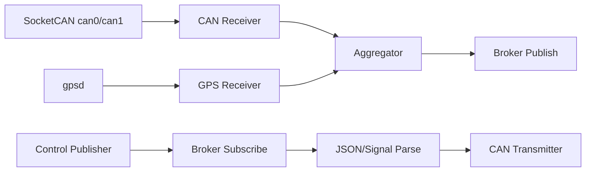

# データフロー & トピック規約

## Topic Naming

- `/${direction}/${DEVICE_ID}/${prefix}`
- 上り: `/tx/{DEVICE_ID}/state`
- 下り: `/rx/{DEVICE_ID}/ctrl`

## 双方向データフロー

## 設定との対応

- publish: `telemetry_options.publish_msgs.topic_prefix`
- subscribe: `telemetry_options.subscribe_msgs.topic_prefixes`
- latch: `socketcan.<if>.latch_frame_ids`
